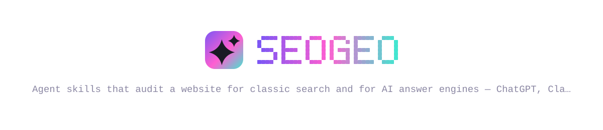
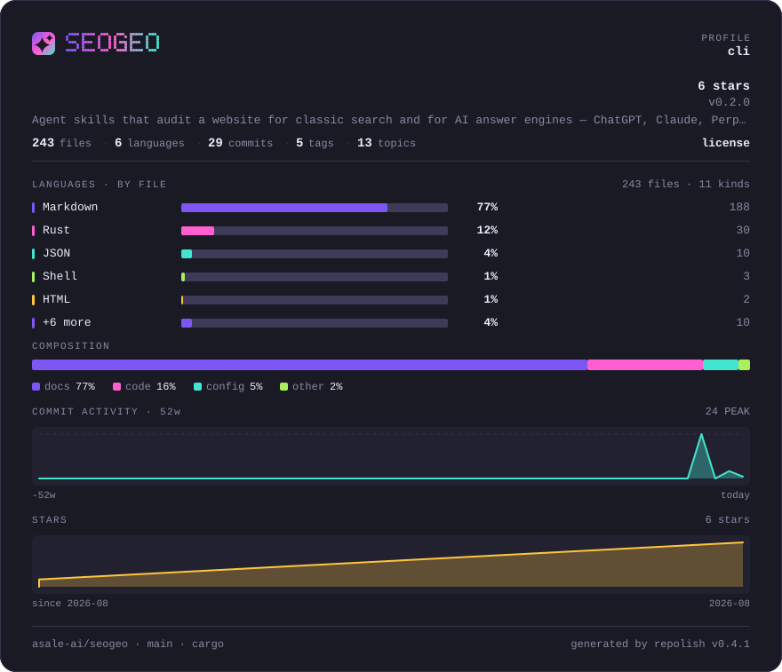
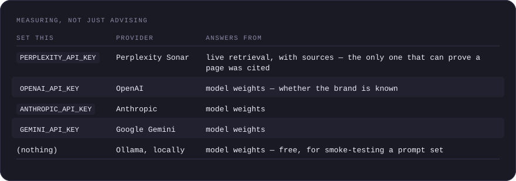
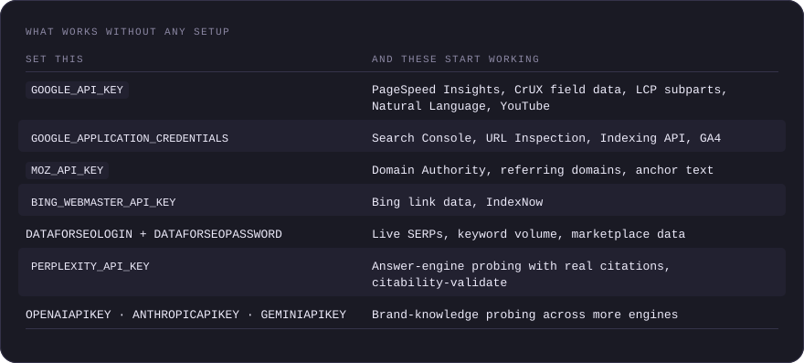
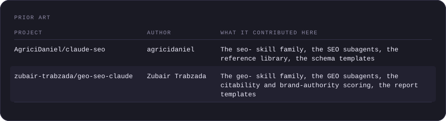
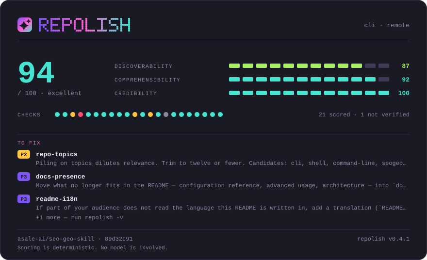

<!-- SPDX-License-Identifier: MIT -->



# SEO + GEO Skills

[](https://github.com/asale-ai/seo-geo-skill/actions/workflows/ci.yml)
[](https://github.com/asale-ai/seo-geo-skill/releases/latest)
[](https://github.com/asale-ai/seo-geo-skill/releases)
[](LICENSE)
[](https://github.com/asale-ai/seo-geo-skill/releases/latest)
[](https://github.com/asale-ai/repolish)






Audit a website for classic search, **measure** whether the answer engines
actually mention it, and read your own server logs to see what their crawlers
did — ChatGPT, Claude, Perplexity, Gemini, Google AI Overviews.

51 skills, 23 subagents, an MCP server, and one static binary that does the
actual work. No Python, no virtualenv, no `pip install`.

## Contents

- [Install](#install)
- [Using the skills](#using-the-skills)
- [Measuring, not just advising](#measuring-not-just-advising)
- [Reading your own logs](#reading-your-own-logs)
- [Use it over MCP](#use-it-over-mcp)
- [What works without any setup](#what-works-without-any-setup)
- [Behind a restrictive network?](#behind-a-restrictive-network)
- [Uninstall](#uninstall)
- [Prior art](#prior-art)
- [Links](#links)

---

## Install

```bash
npx -y @asale/seogeo --version
```

One command, every platform. It downloads the release build for your machine,
verifies it against the published `SHA256SUMS`, and runs it. The npm version
and the release tag are the same number, so `@asale/seogeo@0.2.0` can only ever
fetch `v0.2.0`.

To keep `seogeo` on your PATH instead of going through `npx` each time:

```bash
npm install -g @asale/seogeo
```

Then add the agent skills:

```bash
seogeo install --target npx
```

That hands the skills to [`npx skills`](https://github.com/vercel-labs/skills),
which supports **75+ agents**: Claude Code, Codex, Cursor, OpenCode, Cline,
Copilot, Roo, Windsurf, and the rest. One canonical copy lands in
`~/.agents/skills` and is symlinked into each agent that is present, pinned to
the same tag as the binary, so the skills can never be newer or older than the
code that runs them.

<details>
<summary>No Node?</summary>

The shell installers do the whole job — binary and skills — and need no npm:

```bash
curl -fsSL https://raw.githubusercontent.com/asale-ai/seo-geo-skill/main/install.sh | sh
```

```powershell
irm https://raw.githubusercontent.com/asale-ai/seo-geo-skill/main/install.ps1 | iex
```

Without Node they fall back to writing five known agent directories directly.

</details>

Confirm it worked:

```bash
seogeo --version
seogeo install --list
```

<details>
<summary>Other ways in</summary>

**Skills only, no binary yet** — the bundled `seo-geo-skill` skill will then
walk your agent through installing the binary:

```bash
npx skills add asale-ai/seo-geo-skill --all
```

**ClawHub:**

```bash
clawhub install @asale-ai/seo-geo-skill
```

**With cargo** (Rust 1.82+):

```bash
cargo install seogeo             # or --git https://github.com/asale-ai/seo-geo-skill for main
seogeo install --target npx      # or --target all
```

**Pin a version** — useful in CI, where a floating `latest` makes a build
irreproducible:

```bash
npx -y @asale/seogeo@0.2.0 crawl https://example.com --max-pages 100 --json
```

**Pick your own targets:**

```bash
seogeo install --target npx        # 75+ agents via npx skills
seogeo install --target all        # the five paths seogeo writes itself
seogeo install --target claude     # just one
seogeo install --list              # what is detected here
```

</details>

---

## Using the skills

Ask for what you want in plain language. The skill descriptions are written so
your agent picks the right one; you rarely need to name it.

```
Audit https://example.com for AI search visibility
Does ChatGPT actually mention us when people ask about our category?
Who gets cited instead of us?
Read my nginx logs and tell me what the AI crawlers took
Why isn't my product page getting cited by ChatGPT?
Crawl the whole site and find the duplicate titles
Generate an llms.txt for example.com
```

In Claude Code you can also invoke them directly:

| Command | What you get |
|---------|--------------|
| `/geo visibility <brand>` | **Ask the engines directly** — mention rate, share of voice, who gets cited instead |
| `/geo logs <file>` | **What the AI crawlers actually did**, from your own access logs |
| `/geo audit <url>` | Full GEO + SEO audit with a composite score and a prioritised plan |
| `/geo citability <url>` | Passage-by-passage score for how quotable the page is to an answer engine |
| `/geo crawlers <url>` | Whether each AI crawler is allowed **and** actually served |
| `/geo llmstxt <url>` | Validate an existing `llms.txt`, or generate one |
| `/geo brands <url>` | Brand presence on the platforms AI answers cite most |
| `/geo report-pdf` | Turn the audit into a client-ready PDF |
| `/seo audit <url>` | Full technical + content + schema audit |
| `/seo crawl <url>` | Whole-site crawl: duplicate titles, broken links, thin content |
| `/seo page <url>` | Deep single-page analysis |
| `/seo technical <url>` | Crawlability, indexability, Core Web Vitals, security headers |
| `/seo content <url>` | E-E-A-T, thin content, uncited claims, AI-pattern density |
| `/seo schema <url>` | Detect, validate, and generate structured data |
| `/seo images <url>` | Alt text, dimensions, formats, lazy loading, LCP impact |
| `/seo sitemap <url>` | Sitemap discovery and validation |
| `/seo hreflang <url>` | International SEO annotations |
| `/seo local <url>` | Google Business Profile, NAP, citations, local schema |
| `/seo backlinks <url>` | Link profile, and verification that claimed links exist |
| `/seo drift baseline\|compare <url>` | Catch SEO regressions between deploys |
| `/seo google <command>` | Search Console, PageSpeed, CrUX, GA4, Indexing API |

`seogeo commands` lists every subcommand and the skills that use it.

---

## Measuring, not just advising

Most of this toolkit inspects a page and predicts what an answer engine would
prefer. These commands ask the engines and record what came back.

```bash
seogeo visibility providers                                   # what is configured here
seogeo visibility prompts example.com --topic "project management" --count 20
seogeo visibility run --brand "Acme" --domain acme.com \
  --prompts prompts.json --competitor "Globex" --dry-run       # cost it first
seogeo visibility run --brand "Acme" --domain acme.com --prompts prompts.json
seogeo visibility diff --brand "Acme" --days 30                # exits 2 on a drop
```

Bring your own keys — nothing is proxied through a service:



<details>
<summary>Measuring, not just advising as a table</summary>

| Set this | Provider | Answers from |
|----------|----------|--------------|
| `PERPLEXITY_API_KEY` | Perplexity Sonar | **live retrieval, with sources** — the only one that can prove a page was cited |
| `OPENAI_API_KEY` | OpenAI | model weights — whether the brand is *known* |
| `ANTHROPIC_API_KEY` | Anthropic | model weights |
| `GEMINI_API_KEY` | Google Gemini | model weights |
| *(nothing)* | Ollama, locally | model weights — free, for smoke-testing a prompt set |

</details>

Because the scorer and the measurer live in the same binary, the score can be
checked against reality rather than asserted:

```bash
seogeo citability-validate example.com --prompts prompts.json --max-pages 30
```

It reports the rank correlation between a page's citability score and how often
the retrieval engines actually cited it — and tells you when the sample is too
small to mean anything.

---

## Reading your own logs

`seogeo robots` tells you a crawler is *allowed*. Your access log tells you
whether it *came*, what it *got*, and whether anyone *followed*.

```bash
seogeo logs /var/log/nginx/access.log --sitemap example.com
```

```
1107 lines · 907 AI crawler requests (81.9% of traffic) · 2026-07-01 → 2026-07-27
purpose: 85 search · 810 training · 12 user-action

platform          crawls  referrals crawl:referral  blocked
Anthropic            420          0              —        0
OpenAI               337          1        337.0:1        0
Perplexity            60          5         12.0:1        3

[critical] AI crawlers are being refused — 3 requests returned 403/429 — PerplexityBot (3 of 60)
```

Training crawls can never produce a citation; search crawls can; a
user-action fetch means someone in an assistant asked for that page right then.
Collapsing those into one "AI traffic" number hides the only part that
converts, so this never does.

Combined, common, gzipped, Cloudflare Logpush JSON, and Vercel logs all parse.
Nothing is uploaded — which is the reason this belongs in a local binary and
not a hosted dashboard.

---

## Use it over MCP

For hosts that do not read `SKILL.md` files — Cursor, Windsurf, Claude Desktop,
n8n, your own agent:

```bash
seogeo mcp
```

Same binary, stdio JSON-RPC, 14 tools. Each tool is a whole check that returns
a finished report rather than an API endpoint to assemble.

---

## What works without any setup

Most of it. These need no accounts, no keys, and no quota:

whole-site crawling · AI crawler log analysis · page fetching and rendering ·
SEO element extraction · AI-citability scoring ·
robots.txt and live AI-crawler checks · `llms.txt` validation and generation ·
schema detection, validation, and generation · content quality and
citation-gap analysis · hreflang · image audits · Core Web Vitals *lab* signals ·
speculation rules and bfcache · drift monitoring · WHOIS heritage · parasite-SEO
risk · IndexNow submission · backlink verification · Common Crawl ranks ·
PDF and self-contained HTML reports · scheduled `watch` runs · the MCP server ·
the CRM pipeline.

Answer-engine measurement needs a key, or a local Ollama, which costs nothing.

Field data and account data need credentials. Check what you have:

```bash
seogeo google-auth --check
seogeo backlinks-auth --check
seogeo visibility providers
```



<details>
<summary>What works without any setup as a table</summary>

| Set this | And these start working |
|----------|-------------------------|
| `GOOGLE_API_KEY` | PageSpeed Insights, CrUX field data, LCP subparts, Natural Language, YouTube |
| `GOOGLE_APPLICATION_CREDENTIALS` | Search Console, URL Inspection, Indexing API, GA4 |
| `MOZ_API_KEY` | Domain Authority, referring domains, anchor text |
| `BING_WEBMASTER_API_KEY` | Bing link data, IndexNow |
| `DATAFORSEO_LOGIN` + `DATAFORSEO_PASSWORD` | Live SERPs, keyword volume, marketplace data |
| `PERPLEXITY_API_KEY` | Answer-engine probing with real citations, `citability-validate` |
| `OPENAI_API_KEY` · `ANTHROPIC_API_KEY` · `GEMINI_API_KEY` | Brand-knowledge probing across more engines |

</details>

`seogeo google-auth --setup` prints the exact steps for the Google side.

Two optional binaries widen what is possible: **Chrome** (any of Chrome,
Chromium, or Edge) for rendering, screenshots, and PDFs, and **Node** for the
Unlighthouse sweep. Both are detected automatically, and the commands that need
them say so plainly when they are missing.

---

## Behind a restrictive network?

If requests fail while `curl` succeeds, point the tool at your proxy:

```bash
export SEOGEO_PROXY=http://127.0.0.1:7890
```

`HTTPS_PROXY` and `ALL_PROXY` are honoured too.

---

## Uninstall

```bash
npx skills remove          # if the skills came from npx skills
rm -rf ~/.claude/skills/{seo,geo}* ~/.claude/agents/{seo,geo}*-*.md
npm uninstall -g @asale/seogeo   # if the binary came from npm
rm -f ~/.local/bin/seogeo        # if it came from the shell installer
```

Your data — drift baselines, visibility history, CRM records, cost ledger — lives under
`~/.config/seogeo`, `~/.local/share/seogeo`, and `~/.cache/seogeo`. Remove those
too if you want a clean slate.

---

## Prior art

This project did not start from a blank page. The skill taxonomy, the scoring
models, and much of the domain guidance come from two MIT-licensed projects:



<details>
<summary>Prior art as a table</summary>

| Project | Author | What it contributed here |
|---------|--------|--------------------------|
| [AgriciDaniel/claude-seo](https://github.com/AgriciDaniel/claude-seo) | agricidaniel | The `seo-*` skill family, the SEO subagents, the reference library, the schema templates |
| [zubair-trabzada/geo-seo-claude](https://github.com/zubair-trabzada/geo-seo-claude) | Zubair Trabzada | The `geo-*` skill family, the GEO subagents, the citability and brand-authority scoring, the report templates |

</details>

Both are Python-and-Claude-Code projects; the rewrite here moves every
execution step onto the `seogeo` binary and widens the install to 75+ agents.
If you want the originals — including the parts this port left behind — go read
them. [Attribution](THIRD-PARTY-NOTICES.md) records the full chain, including
the upstream community contributors whose credit travels with the code.

---

## Links

[Contributing](CONTRIBUTING.md) ·
[Security](SECURITY.md) ·
[Attribution](THIRD-PARTY-NOTICES.md) ·
[MIT](LICENSE)

## Polished with repolish



This card is generated by [repolish](https://github.com/asale-ai/repolish) and is a plain file in this repository — no external fonts, no scripts, nothing hosted by a third party. To score your own: `npx @asale/repolish`.

